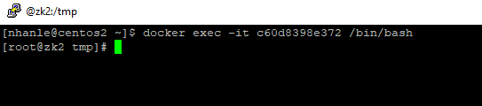
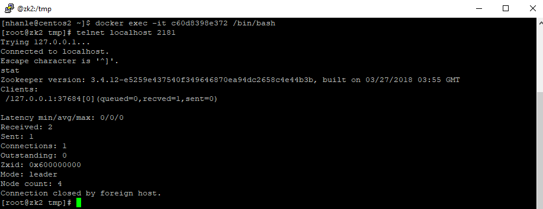

# Setup A ZooKeeper Cluster

### Prerequisite

 - A Docker Swarm with 3 nodes: one Manager node and two Woker nodes. In my case, I have three servers:
	+ centos1 is the Swarm Manager. It is Centos 7 installed with Docker 18.06.0-ce and docker-compose version 1.22.0
	+ centos2 is a Worker , same configuration as Manager node
	+ centos3 is a Woker , same configuration as Manager node
 - A local Docker Registry. in my case it is registry.nhan.com:5000. This registry is run on the Manager node. Make sure all the workers can access to this registry to download the image otherwise you will get errors
 
### Prepare the ZooKeeper image

Let check out this repository. Here are some explainations
 + "Dockerfile" is the file to build the ZooKeeper image
 + "zk-init.sh" to the bash script which will create zoo.cfg with correct client port and list of servers
 
 
Now let build the image and tag it as "zookeeper:3.4"

```
docker build --force-rm -t zookeeper:3.4 .
```


Tag and push it to the registry

```
docker tag zookeeper:3.4 registry.nhan.com:5000/zookeeper:3.4
docker push registry.nhan.com:5000/zookeeper:3.4
```


### Deploy and run the services

Read the docker-compose.yml for details. Here are some important notes

- The zk1 service will be scheduled to run only 1 replica on the Manager node. it expose the port 2181
- zk2 service will run 1 replica on the centos2 worker. its client port is 2182, and published port 2181 
- zk3 service will run 1 replica on the centos2 worker. its client port is 2183, and published port 2181
- the other port 2888 and 3888 are used for zookeeper election. Keep them are

```
	docker stack deploy --compose-file=docker-compose.yml zk
```


### Check the result

```
	docker service ls
```


Ensure the zookeeper is running properly on 3 servers

Run this on centos2 server (actually any node)

Get the container ID first
```
docker ps
```

Attache to the contaier to do some test
```
 docker exec -it <containerid> /bin/bash
```
Now we are inside the container



Run telnet and key in "stat"


We see that instance on centos2 is the leader. Now check the other nodes


### Caveat

Docker overlay network uses port mapping and forwarding. If the Docker host disables ip4 forwarding, there will be error: the node cannot connect to each others

Therefore, make sure ip4 forwarding is enabled on the Docker host (not the container). Below is command to check on Centos 7

```
	sudo vi /etc/sysctl.d/11-gce-network-security.conf
```


